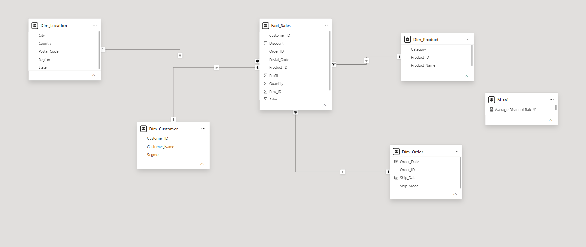
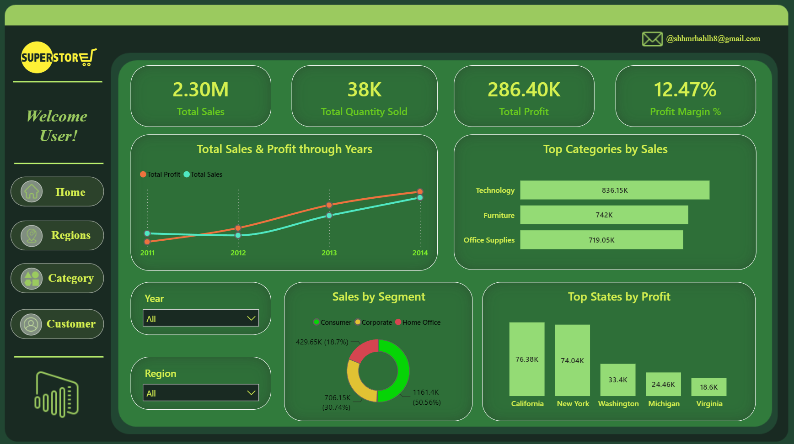
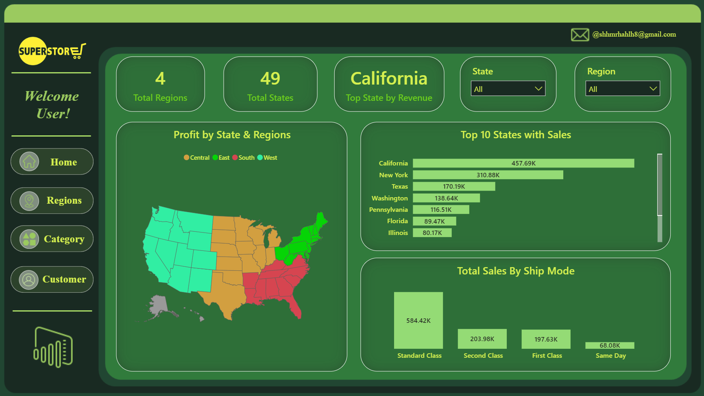
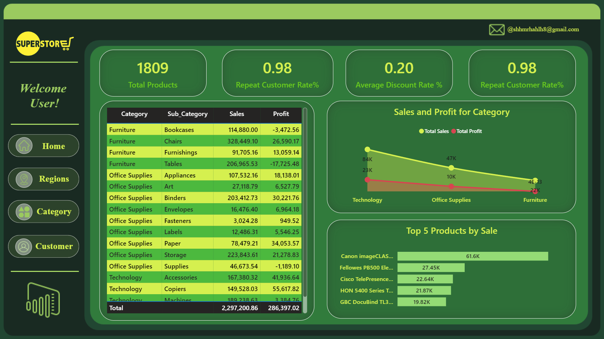
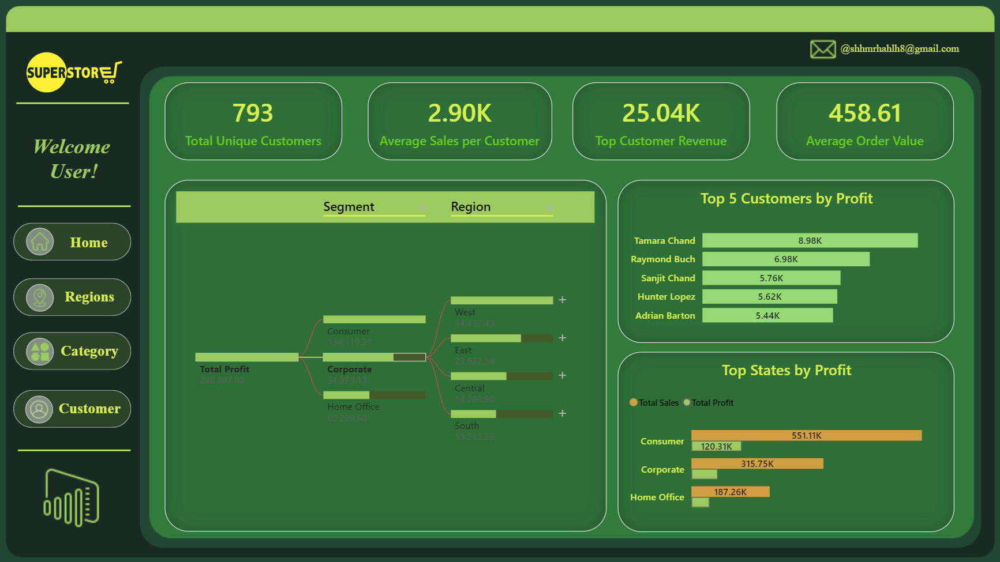

# Superstore End-to-End Data Pipeline & Executive Analytics Dashboard

A comprehensive end-to-end business intelligence project analyzing sales, profitability, customer segmentation, and regional performance for the Superstore dataset. The project demonstrates an complete ETL pipeline starting from raw data ingestion to database modeling and interactive visual reporting.

---

## 📋 Executive Summary

This project transforms raw transactional data into actionable operational insights. By leveraging **Python**, **SQL Server**, **Power Query Editor**, and **Power BI**, the resulting four-page dynamic dashboard enables stakeholders to trace revenue growth, analyze discount impacts on margins, identify top-value customers, and pinpoint underperforming product categories across geographic markets.

---

## 🛠 Tech Stack & Tools

* **Data Processing & ETL:** Python (`pandas`, `sqlalchemy`), Excel, Power Query Editor
* **Database & Storage:** Microsoft SQL Server
* **Data Visualization:** Power BI (DAX, Interactive Slicers, Custom Page Navigation)
* **Documentation & Version Control:** Git, Markdown

---

## ⚙️ Data Architecture & Pipeline Steps

1. **Data Ingestion & Cleaning:**
   * Ingested raw Excel datasets containing order details, shipping information, customer segments, and regional hierarchy.
   * Standardized schema types, fixed missing attributes, and verified cross-table normalization rules.

2. **Database Ingestion & Schema Transformation (Python & SQL):**
   * Built an ETL pipeline script (`python_Scripts`) leveraging **SQLAlchemy** and **Pandas** to programmatically push clean transaction data into an **MS SQL Server** instance.
   * De-normalized flat tables into a optimized **Star Schema** relational design using SQL scripts (`SQL_Schema`) to separate transactional events from core business dimensions.

3. **Data Modeling & DAX (Power Query & Power BI):**
   * Imported schema tables into Power BI and validated `1:N` single-direction relationships across dimensions and the fact table.
   * Transformed dynamic parameters using **Power Query Editor**.
   * Formulated DAX measures for core KPIs: Total Sales, Total Profit, Profit Margin %, Repeat Customer Rate %, and Average Order Value (AOV).

   
   
---

## 📊 Dashboard Overview

The dashboard comprises **four distinct view pages**, styled with a custom high-contrast executive theme and custom icon navigation:

### 1. Executive Summary (Home Page)
Provides a high-level strategic snapshot of aggregate business health across years and product divisions.
* **Key Metrics:** Total Sales ($2.30M), Total Quantity (38K), Total Profit ($286.40K), Profit Margin % (12.47%).
* **Visual Highlights:** Multi-year trend analysis, sales distribution by category, and regional profit distribution.

---

### 2. Regional Performance
Breaks down revenue, orders, and shipping mode preferences across 4 primary regions and 49 states.
* **Key Insights:** Identifies California and New York as primary revenue drivers; evaluates profit margins by state map boundaries and ship mode volume.

---

### 3. Category & Product Performance
Delivers deep granularity on product performance, discount sensitivities, and line-item profitability.
* **Key Insights:** Highlights high-volume items vs. margin-draining categories (e.g., negative profit lines in select sub-categories).

---

### 4. Customer Analysis
Monitors buyer trends, order frequencies, and customer lifetime concentration.
* **Key Metrics:** Total Unique Customers (793), Average Sales per Customer ($2.90K), Top Customer Revenue ($25.04K), Average Order Value ($458.61).
* **Visual Highlights:** Top 5 customers by profit, decomposition trees for profit origin, and state breakdown per segment.

---

💡 Business Questions & Strategic Insights

The following key business questions were derived directly from the dashboard analysis to drive operational and executive decision-making:

💡 Q: How does discount depth impact overall profitability, and where are we losing money?

Data Insight: High-volume sales in specific sub-categories yield negative net profits despite strong top-line revenue, directly correlated with aggressive discounting practices.

Business Takeaway: Uncapped discounting strategies are cannibalizing profit. Certain product lines are being sold at a loss to artificially drive volume.

Executive Recommendation: Implement automated discount thresholds requiring regional manager approval for discounts exceeding 20% on low-margin sub-categories.

💡 Q: Which product categories yield high sales volume but act as a direct drain on net profits?

Data Insight: Select sub-categories generate consistent order volume but consistently record negative profit margins.

Business Takeaway: High sales volume does not equal business health. These loss-leading sub-categories fail to convert buyers into higher-margin cross-sell products.

Executive Recommendation: Perform a portfolio audit: renegotiate supplier costs, raise baseline prices on unprofitable SKUs, or bundle them exclusively with high-margin items.

💡 Q: How dependent is our revenue stream on top-tier individual customers versus the broader base?

Data Insight: Out of 793 unique customers, average sales per customer stand at $2.90K, while the single top customer accounts for $25.04K in revenue.

Business Takeaway: Heavy account concentration risk. The single highest-value buyer contributes nearly 10x the average customer lifetime spend.

Executive Recommendation: Launch a dedicated Key Account Management (KAM) retention program for top-decile buyers while establishing automated win-back workflows for churning mid-tier accounts.

💡 Q: Which geographic markets are driving net revenue, and where are shipping costs eroding margins?

Data Insight: Across 4 primary regions and 49 states, California and New York serve as the primary engines of revenue and net profit, while mid-tier states show lower net returns due to higher shipping cost-to-revenue ratios.

Business Takeaway: Revenue concentration is heavily weighted in coastal hubs. Mid-tier state orders suffer from high logistics overhead relative to order size.

Executive Recommendation: Double down on localized marketing in CA and NY while auditing fulfillment center routing and setting minimum order thresholds for free shipping in mid-tier markets.

💡 Q: What is our unit-level purchase profile, and how can we leverage it to scale top-line growth?

Data Insight: The business maintains an Average Order Value (AOV) of $458.61 across total transactional orders.

Business Takeaway: Basket sizes are substantial, indicating strong business-to-business (B2B) or bulk ordering behavior.

Executive Recommendation: Introduce dynamic checkout prompts (e.g., "Add $41 more to unlock premium shipping") to push baseline AOV beyond the $500 threshold.
---

## ✉️ Author
* **Developer:** Shahim Rhahleh
* **Contact:** [shhmrhahlh8@gmail.com](mailto:shhmrhahlh8@gmail.com)

